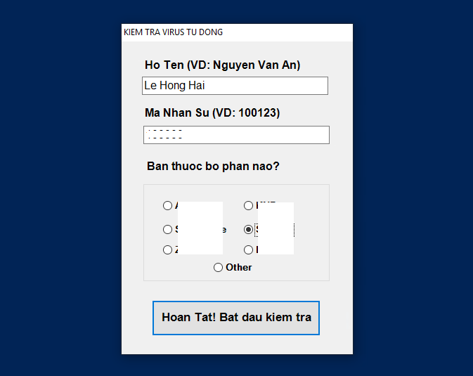
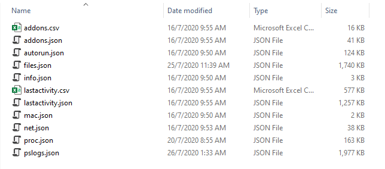
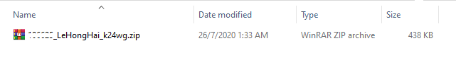

# Warning!
The version of this tool is old. I no longer update this project. Please check the new version of the tool here: [**malcheck-client**](https://github.com/hailehong95/malcheck-client)

# Malware Automation Check Client
A Tool for Malware checking in client computer, collecting security data, standardized output and then send to the Central Storage System.

## 1. Capability

* Check running processes: Digital Signatures, CommandLine, ImageHash, VirusTotal,.v.v.
* Check Autoruns keys: Digital Signatures, VirusTotal,.v.v..
* Extract Powershell logs automatically
* Check Digital Signatures, FileHash, VirusTotal, PE files in suspicious directories
* Check the network connections on the system
* Check the Add-ons installed on the browser
* Send Report to the centralized storage system

## 2. General use

### 2.1. Notes

* The program needs to be run with: **Administrator**
* Some Anti-virus programs may mistake the tool for malware.
* Make sure the machine has an internet connection when running the tool.

### 2.2. Run the tool

Running the tool will take a while, depending on the machine, but it will be fast or slow. However, during the run, the user is not affected and can still work normally. Run the following program:

```bash
MalAuto.exe
```

The program will ask to enter the information of the personnel, this is to identify each employee when performing the scan. Need to enter the correct information Full Name and Personnel Code:



### 2.3. Result

When finished, the results will be saved in the **reports** folder, example:




**upload** folder will contain a single compressed file that includes all files and folders contained in **report**. The file name is set according to the identifier of each machine:



## 3. System Requirements

* Powershell 5.0 or higher
* Windows 10, Windows Server 2016, Windows Server 2019
